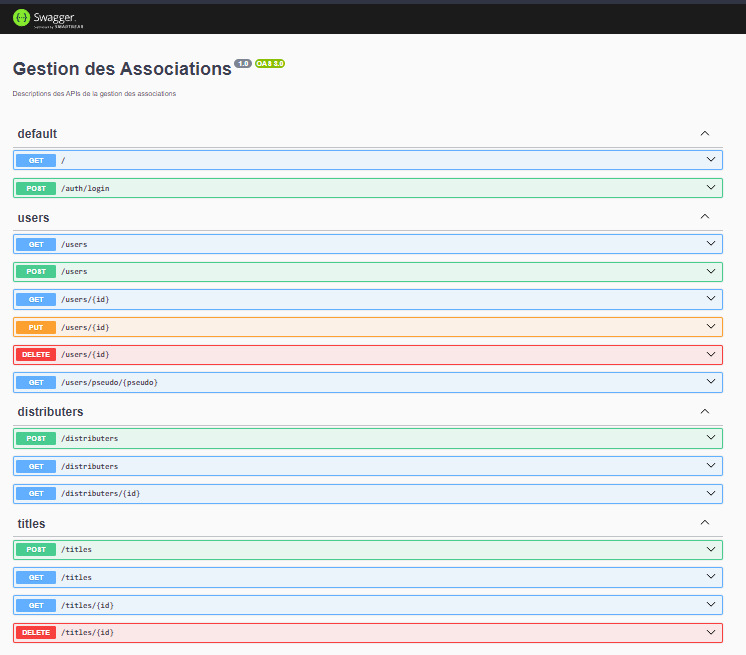

# Manuel utilisateur
Comme détaillé dans la <a href="./ROADMAP.md">roadmap</a>, la partie front de l'application n'est pas avancée. Nous avons un nombre très restreint de fonctionnalités. Aussi, l'affiche n'est pas encore adapté à des petits écrans ou à des écrans de téléphone.

## API Backend
Le back-end est accessible sous la forme d'une API REST. Vous pouvez connaitre la liste des requêtes disponibles en vous entrant l'url `http://localhost:3000/api/` dans votre navigateur.

## Page d'accueil
Nous avons une page d'accueil

Affichant pour l'instant l'intégralité des médias existants dans la base de données. Les titres ici sont identiques car il correspond au titre que nous avons utilisé pour notre média « test ».

Une barre de recherche au dessus de la liste permet de rechercher par titre ou par identifiant un média dans la liste.

## Utilisateurs
Nous avons aussi une liste des utilisateurs

Cette page n'est pas définitive et affiche pour l'instant des informations en trop. Par la suite nous souhaitons n'afficher que les pseudos, dans le but de faciliter la recherche du profil d'une connaissance.

Là aussi, il existe un barre de recherche pour filtrer les résultats dans la liste.